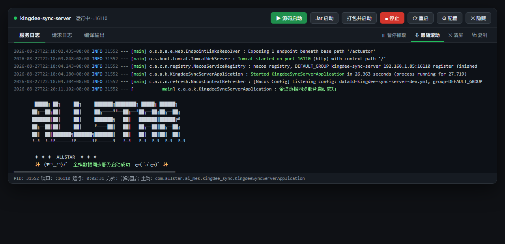
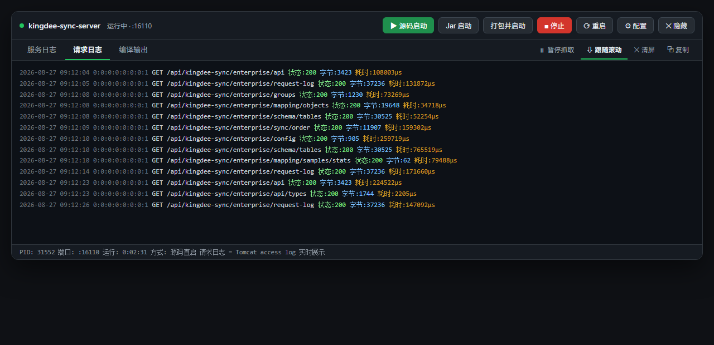
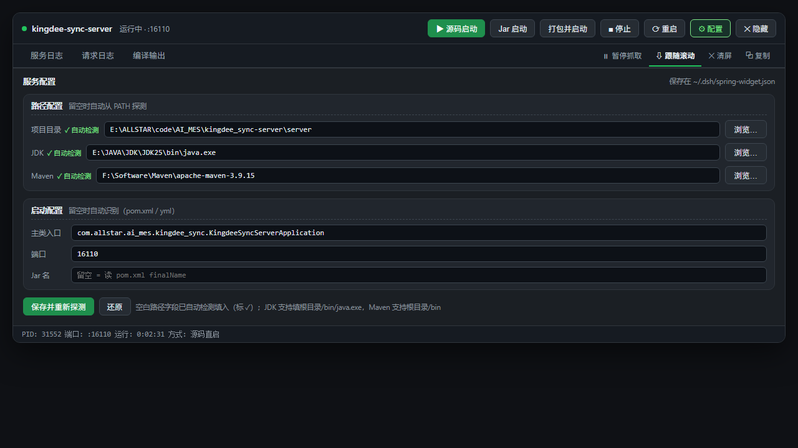

<div align="center" style="font-size:14px; font-family: -apple-system, BlinkMacSystemFont, 'Segoe UI', sans-serif;">
  <span style="display:inline-block; border:1px solid #d0d7de; border-radius:8px; overflow:hidden;">
    <a href="README.md" style="display:inline-block; padding:6px 22px; text-decoration:none; color:#1f2328; background:#fff; font-weight:600;">简体中文</a><a href="README_EN.md" style="display:inline-block; padding:6px 22px; text-decoration:none; color:#0969da; background:#f6f8fa;">English</a>
  </span>
</div>

# dsh-spring-widget

> DSH（DeepSeek Harness）插件：顶栏 IDEA 式 **Spring Boot 后端服务管理器**

在 DSH 顶栏一键管理你的 Spring Boot 后端：源码直启 / Jar 打包启动 / 停止 / 重启，带实时三页签日志控制台（服务日志 · 请求日志 · 编译输出），无需离开对话即可观察与操作后端进程。


---

## 📷 界面预览

| 服务日志 | 请求日志 |
|---|---|
|  |  |

| 配置面板 |
|---|
|  |

---

## ✨ 功能特性

### 🚀 启动模式

| 模式 | 说明 |
|---|---|
| **▶ 源码直启** | `mvn compile` 增量编译 + `java @argfile` 直启主类，**无需打包**即可运行调试（生成 `target/sbsv-args.txt` 绕开 Windows 命令行长度限制） |
| **📦 打包并启动** | 先 `mvn clean package -DskipTests`（**先清理上次打包残余**再全新打包），再 `java -jar` 启动 |
| **Jar 启动** | 直接启动已存在的打包产物（不重复打包） |

### 📺 三页签实时日志控制台

| 页签 | 内容 |
|---|---|
| **服务日志** | 应用 stdout/stderr 输出（UTF-8 编码修正，中文不乱码） |
| **请求日志** | Tomcat access log —— 每个 HTTP 请求一行：`时间 IP 方法 路径 状态:xxx 字节:xxx 耗时:xxxµs` |
| **编译输出** | Maven 编译/打包进程输出（stdout+stderr 合并） |

- **增量拉取**：每秒轮询只取新增内容，日志实时滚动
- **跟随滚动**：默认自动滚到底部，向上翻页自动暂停跟随
- **清屏**：只清当前激活页签的日志内容，保留读取偏移（历史不闪回）
- **复制**：一键复制当前页签全部日志

### 🗂 分组配置面板

- **路径配置**：项目目录 / JDK / Maven（留空自动从 PATH 探测）
- **启动配置**：主类入口 / 端口 / Jar 名（留空自动识别）
- **自绘目录选择器**：面包屑导航 + 子目录列表 + 手动输入路径，支持 JDK 根目录 → 自动补 `bin\java.exe`
- 配置持久化到 `~/.dsh/spring-widget.json`，重启后依然生效

### 🌙 深浅色主题适配

完整适配 DSH 浅色/深色主题，页签、按钮、标题在深色下清晰可读。

---

## 📦 安装

### 从 GitHub Release 安装

```bash
dsh plugin add dsh-spring-widget --source github:wrw-dev/dsh-spring-widget
```

### 本地开发安装（link 模式，改代码即时生效）

```bash
# 在你的 profile package.json 的 dependencies 加入：
#   "dsh-spring-widget": "link:C:/<你的用户名>/.dsh/plugins/dsh-spring-widget"
# 并在 dsh.profile.bundles 数组加入 "dsh-spring-widget"
```

**宿主改动**（`index.js`）需重启 DSH；**客户端改动**（`client/client.js`）刷新页面即可生效（webserver 实时下发）。

---

## 🎮 使用

1. 顶栏右侧出现 **后端服务** 微件（⚙ 按钮 + 状态点 + 日志入口）
2. 点击微件打开控制台
3. 点击「▶ 源码启动」或「📦 打包并启动」
4. 在「服务日志 / 请求日志 / 编译输出」页签实时观察输出
5. 需要时点「■ 停止」/「⟳ 重启」

> 💡 首次启动会自动探测项目结构（JDK、Maven、主类、端口），也可在「⚙ 配置」里手动指定。

---

## ⚙️ 配置项

| 字段 | 说明 | 自动探测 |
|---|---|---|
| `cwd` | 项目目录（server 目录） | ✅ pom.xml / yml 所在 |
| `javaPath` | JDK 的 java.exe 路径 | ✅ PATH 中的 java |
| `mavenHome` | Maven 根目录 | ✅ PATH 中的 mvn |
| `mainClass` | 主类入口 | ✅ 扫描 @SpringBootApplication |
| `port` | 服务端口 | ✅ bootstrap.yml / application.yml |
| `jarName` | Jar 文件名 | ✅ pom.xml finalName / artifactId |

配置保存在 `~/.dsh/spring-widget.json`：

```json
{
  "cwd": "E:/path/to/project/server",
  "javaPath": "E:/JAVA/JDK/JDK25/bin/java.exe",
  "mavenHome": "F:/Software/Maven/apache-maven-3.9.15",
  "mainClass": "com.example.AppApplication",
  "port": "16110",
  "jarName": ""
}
```

---

## 📁 项目结构

```
dsh-spring-widget/
├── index.js            # 宿主半区：服务管理、子进程、RPC、模型工具 springboot_service
├── client/
│   └── client.js       # 浏览器半区：顶栏微件、控制台 UI、配置面板
├── docs/               # README 截图
│   ├── shot-console.png
│   ├── shot-access.png
│   └── shot-config.png
├── README.md           # 说明（简体中文）
├── README_EN.md        # README（英文 English）
├── cordis.patch.yml    # 插件装配声明
└── package.json        # 插件元数据
```

---

## 🔌 模型工具

安装后自动注册工具 **`springboot_service`**，通过对话即可操作后端：

```
springboot_service action=start mode=src                    # 源码直启
springboot_service action=start mode=jar rebuild=true       # 打包并启动
springboot_service action=stop                              # 停止
springboot_service action=status                            # 状态 + 日志尾部
```

---

## 🧱 技术实现要点

- **RPC 通道**：宿主 `ctx.connection.rpc.handle('/spring-widget', ...)` ↔ 客户端 `connection.rpc.call('/spring-widget', ...)`（独立频道，不干扰官方 `/api`）
- **子进程采集**：`SubprocessCollect` 内存尾窗 + spill 完整落盘（重扇区可恢复全量）
- **编码修正**：JDK18+ 默认 native 编码 → JVM 参数 `-Dstdout.encoding=UTF-8` / `-Dstderr.encoding=UTF-8` / `-Dlogging.charset.console=UTF-8`
- **请求日志**：JVM 参数开启 Tomcat access log（`-Dserver.tomcat.accesslog.enabled=true`），写入 `~/.dsh/spring-widget-access/`，由宿主增量读取展示
- **Maven 执行**：`cmd.exe /c <mvn.cmd>`（绕开 Node 24 禁止直接 spawn .cmd 的限制）

---

## © License

UNLICENSED —— 内部使用。

---

## 🔗 相关

- [DeepSeek Harness](https://github.com/deepseek-ai/dsh)
- [DSH 插件生态 dsh-plugin](https://github.com/topics/dsh-plugin)